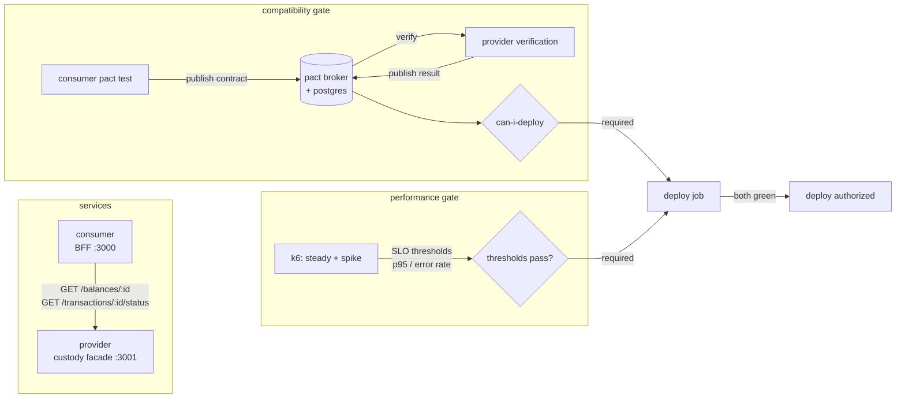

# deploy-gates

Release gating as a unified concept: a deploy is allowed only when two
independent, required CI gates are green.

1. **Compatibility gate**: Pact consumer-driven contracts, verified via a
   self-hosted Pact Broker and `can-i-deploy`
2. **Performance gate**: k6 scenario load tests with SLO thresholds as hard
   pass/fail criteria

The thesis: contract verification and performance thresholds are the same kind
of object, machine-checkable answers to "is this build safe to release?", and
belong in the same gating architecture. Neither is a report to read; both are
verdicts that block.

This repo proves it both ways with two permanently-red branches: a build that is
functionally perfect but breaks the contract ([blocked by the Pact
gate](https://github.com/qasimmahmood95/deploy-gates/actions/runs/29653264724)),
and a build that honors the contract but regresses latency ([blocked by the k6
gate](https://github.com/qasimmahmood95/deploy-gates/actions/runs/29653266437)).
In both runs every other check is green, and the deploy is skipped.

## Architecture



The provider is a fictional, read-only facade in the style of a digital-asset
custody API (balances, transaction status), a nod to the sibling
[VaultChain](https://github.com/qasimmahmood95) work, with no code dependency on
it. The consumer is a thin BFF exposing one aggregate endpoint. Both are
deliberately minimal: the services exist to carry the gates, not the other way
around.

## The two gates

### Compatibility gate (Pact)

The consumer's expectations are pinned as a Pact contract generated by testing
the real client code against a mock provider. In CI:

1. `npm run test:pact` generates the contract from the consumer test
2. `npm run pact:publish` sends it to the self-hosted broker, versioned by
   commit and branch
3. `npm run pact:verify` starts the provider in-process, verifies it against
   the contract, and publishes the result back
4. `npm run pact:can-i-deploy` issues the verdict: green only if this exact
   consumer/provider version pair has a successful verification

The broker (plus its postgres) runs behind the `pact` compose profile with
local-only dummy credentials, deliberately public and allowlisted
string-by-string for the secret scan. See
[ADR-0002](docs/adr/0002-self-hosted-broker-vs-pactflow.md) for why self-hosted
instead of PactFlow.

### Performance gate (k6)

Two scenarios in [`k6/load.js`](k6/load.js) run against the provider:

- **steady**: ramping to sustained load; carries the primary SLO of p95 under
  250ms, error rate under 1%, and 100% response-correctness checks
- **spike**: a sharp burst with looser resilience bounds (p95 under 500ms,
  errors under 5%) so runner noise can't flake the steady SLO

A threshold breach makes k6 exit non-zero. The thresholds are the gate; no
wrapper script interprets results. Tighten to force a red run: `P95_MS=1 k6 run
k6/load.js`. See [ADR-0001](docs/adr/0001-k6-here-autocannon-elsewhere.md) for
why k6 here while autocannon lives in VaultChain.

## The unified deploy gate

Both gates are ordinary CI jobs, so the deploy is a job that depends on both,
plus the rest of the board:

```yaml
deploy:
  needs: [checks, compose-smoke, compatibility-gate, performance-gate, secret-scan]
```

Default `needs` semantics mean the deploy job cannot start unless every gate
succeeded. That is scheduler-enforced, not script-promised. A `gate status
summary` job runs `if: always()` and writes both verdicts side by side into the
run's job summary, so a red run shows exactly which gate blocked. See
[ADR-0003](docs/adr/0003-gates-are-jobs-not-scripts.md) for why jobs, not
scripts.

`deploy` deliberately runs on every green build (PRs included) so the block is
observable on branches; a real pipeline would additionally guard it to `main`.

### Branch protection

To enforce on `main`, mark these as required status checks (Settings, then
Branches): `compatibility gate (pact)`, `performance gate (k6)`,
`lint / typecheck / test`, `secret scan (gitleaks)`.

## The evidence: two planted defects

Two long-lived branches each break exactly one gate. Neither will ever merge.

|                         | [`defect/contract-break`](https://github.com/qasimmahmood95/deploy-gates/tree/defect/contract-break) ([PR #6](https://github.com/qasimmahmood95/deploy-gates/pull/6)) | [`defect/perf-regression`](https://github.com/qasimmahmood95/deploy-gates/tree/defect/perf-regression) ([PR #7](https://github.com/qasimmahmood95/deploy-gates/pull/7)) |
| ----------------------- | --------------------------------------------------------------------------------------------------------------------------------------------------------------------- | ----------------------------------------------------------------------------------------------------------------------------------------------------------------------- |
| The change              | provider renames `accountId` to `id`, updates its own tests to match                                                                                                  | provider gains ~350ms latency on data endpoints                                                                                                                         |
| lint / typecheck / test | green (the rename is self-consistent)                                                                                                                                 | green (behaviour unchanged)                                                                                                                                             |
| compatibility gate      | **red**: consumer's contract still expects `accountId`                                                                                                                | green (responses still contract-correct)                                                                                                                                |
| performance gate        | green (latency unaffected)                                                                                                                                            | **red**: steady p95 breaches 250ms                                                                                                                                      |
| deploy                  | **skipped**                                                                                                                                                           | **skipped**                                                                                                                                                             |
| Red run                 | [actions/runs/29653264724](https://github.com/qasimmahmood95/deploy-gates/actions/runs/29653264724)                                                                   | [actions/runs/29653266437](https://github.com/qasimmahmood95/deploy-gates/actions/runs/29653266437)                                                                     |

The symmetry is the point: one build fails only the contract gate, the other
fails only the performance gate, and either alone blocks the deploy. Unit tests
catch neither; both defect branches pass `lint / typecheck / test`.

## Running it yourself

Requires Node 22+ and Docker.

```sh
npm ci
npm run lint && npm run typecheck && npm run test   # build-quality checks

docker compose up --build                            # provider :3001, consumer :3000
curl http://localhost:3000/accounts/acc-001/overview

npm run test:pact                                    # generate the contract
npm run pact:verify                                  # verify provider against it

docker compose --profile pact up -d                  # broker UI at :9292 (pact/pact)

k6 run k6/load.js                                    # performance gate locally
P95_MS=1 k6 run k6/load.js                           # force it red
```

Secret scanning is enforced by [gitleaks](https://github.com/gitleaks/gitleaks)
as a pre-commit hook and a required CI job. The repo's no-secrets invariant has
held since the first commit.

<!-- docs/img: broker UI screenshots (contract list + verification matrix) to be
     captured from a local `docker compose --profile pact up` session. -->

## Repository layout

```
deploy-gates/
├── services/
│   ├── provider/          # custody-facade API (Fastify)
│   └── consumer/          # client service (Fastify)
├── pact/                  # consumer contract tests + provider verification
├── k6/                    # load scenarios + threshold config
├── docker-compose.yml     # services + pact broker (profile: pact)
├── .github/workflows/     # gates + unified deploy pipeline
└── docs/
    ├── adr/               # architecture decision records
    └── img/               # CI/broker screenshots
```

## ADRs

- [0001: k6 for this repo's gate; autocannon stays in VaultChain](docs/adr/0001-k6-here-autocannon-elsewhere.md)
- [0002: self-hosted Pact Broker instead of PactFlow](docs/adr/0002-self-hosted-broker-vs-pactflow.md)
- [0003: gates are jobs wired with `needs`, not steps in a script](docs/adr/0003-gates-are-jobs-not-scripts.md)

## License

[MIT](LICENSE)
